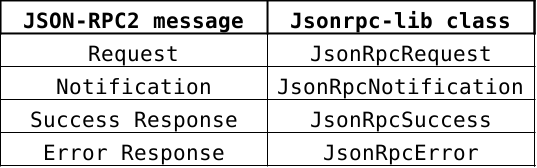

# JSON-RPC 2.0 library

[]
[]
[size](https://img.shields.io/github/repo-size/lampajr/jsonrpc-lib?style=plastic)

jsonrpc-lib is a nodejs package for parsing and serialising JSON-RPC2 messages.

Inspired by [jsonrpc-lite](https://github.com/teambition/jsonrpc-lite/blob/master/README.md).

**Version**: 0.1.0

**Date**: December 3, 2019

**Author**: Andrea Lamparelli

## Protocol: JSON-RPC2

This package implements the aforementioned **JSON-RPC2**, which is  is a stateless, light-weight remote procedure call (RPC) protocol. It is transport agnostic in that the concepts can be used within the  same process, over sockets, over http, or in many various message  passing environments. It uses [JSON](http://www.json.org) ([RFC 4627](http://www.ietf.org/rfc/rfc4627.txt)) as data format. This protocol defines three different kind of message, all of them share a common field called *jsonrpc*, which is a string specifying the version of the JSON-RPC protocol. In our case it MUST be exactly "2.0".

#### Request

An rpc call is represented by sending a Request object to a Server. In addition to the jsonrpc field, this message has the following member:

* *id*, An identifier established by the Client that MUST contain a String, Number, or NULL value if included.
* *method*, A String containing the name of the method to be invoked.
* *params*, A Structured value that holds the parameter values to be used during the invocation of the method. 

#### Notification

A Notification is a Request object without an "id" member. A Request  object that is a Notification signifies the Client's lack of interest in the corresponding Response object, and as such no Response object needs to be returned to the client. The Server MUST NOT reply to a  Notification, including those that are within a batch request.

#### Response

When a rpc call is made, the Server MUST reply with a Response, except  for in the case of Notifications. The Response is expressed as a single  JSON Object, there two different kind of responses, both includes the *id* member that MUST be the same provided in the request:

* **Success**, this response is returned if the client-provided request succeed, this object includes a field called *result*, that contains the specific result provided by the method invocation.
* **Error**, this response, instead, is returned if the client-provided request failed. This object has another member called *error*, which is represented by a structure with three members: *code*, *message* and *data* which provide information about the error that has occurred.

For more information about the protocol please take a look at [JSON-RPC2 specification](https://www.jsonrpc.org/specification) page.

## Installation

You can easily install the package from the nodejs package manage (npm)

```bash
npm install jsonrpc-lib
```

## Getting Started

Once you have installed the package either globally or locally, you just have to import the package whenever you require it, like as follow.

Using *javascript*:

```javascript
const jsonrpc = require('jsonrpc-lib')
```

Using *typescript*:

```typescript
import jsonrpc from 'jsonrpc-lib'
```

This package provides some help functions that allow developers to easily generate instances of JSON-RPC2 messages, a complete mapping among JSON-RPC2 messages and jsonrpc-lib classes is explained in **Table 1**.

```typescript
jsonrpc.generateRequest(...)	 	// generate a JsonRpcRequest object
jsonrpc.generateNotification(...) 	// generate a JsonRpcNotification object
jsonrpc.generateSuccess(...)		// generate a JsonRpcSuccess response
jsonrpc.generateError(...)			// generate a JsonRpcError response
```

<br/>



**Table 1** provide a mapping between the JSON-RPC2 messages and the equivalent jsonrpc-lib classes

### Parsing

Moreover this package provides a way to parse string payload messages (e.g., received from http request) into JSON-RPC2 objects (i.e., jsonrpc-lib classes) using a function called *parse*. This function parse the string data checking if it is a valid JSON-RPC2 message, if so it generate the equivalent class instance, otherwise it throws an error object which contains information about what went wrong during parsing. This object is a valid error object that can be put inside the JsonRpcError response and then sent to the client. The *parse* function can be easily used as follow:

```typescript
const rpcMessage = jsonrpc.parse(msg);
```

where ```rpcMessage``` will contain the class instance of the specific parsed msg, if valid, otherwise an ErrorObject will be thrown, hence the function should be properly surrounded by the *try-catch* statement.

In order to avoid the function to throws an Error, the ```msg``` data should be a valid JSON-RPC2 payload or an array of them. 


## Examples

### Parse

**Success**

This example shows a succeed invocation of the *parse* function, that will generate the equivalent JsonRpc class of the ```msg``` parsed.

```typescript
const msg = '{"jsonrpc":"2.0", "id":"abcdefg", "method":"send", "params": {"from": "my-addr", "to":"your-addr", "amount":50}}';

try {
    const rpcMessage = jsonrpc.parse(msg);  // execution succeed
    // rpcMessage is an instance of JsonRpcRequest
    //{
    //	jsonrpc: "2.0",
    //	id: "abcdefg",
    //	method: "send",
    //	params: {
    //		"from": "my-addr",
    //		"to": "your-addr",
    //		"amount": 50
	//	}
    //}
} catch(err) {
    console.log(err)  // this won't be executed
}
```

**Fail**

This, instead, provide ad example of failed invocation. In this case the failure is due to the fact that the client is trying to used an unsupported jsonrpc version.

```typescript
const msg = '{"jsonrpc":"1.0", "id":"abcdefg", "method":"send", "params": {"from": "my-addr", "to":"your-addr", "amount":50}}';

try {
    // execution will fail since the jsonrpc 1.0 version is not supported
    const rpcMessage = jsonrpc.parse(msg); 
} catch(err) {
    console.log(err)  // this error is an ErrorObject instace
    //{
    //	code: -32600
    //	message: "Invalid request"
    //	data: "Version 1.0 not supported! Please use 2.0 instead."
    //}
}
```

